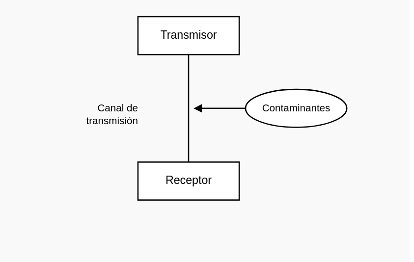
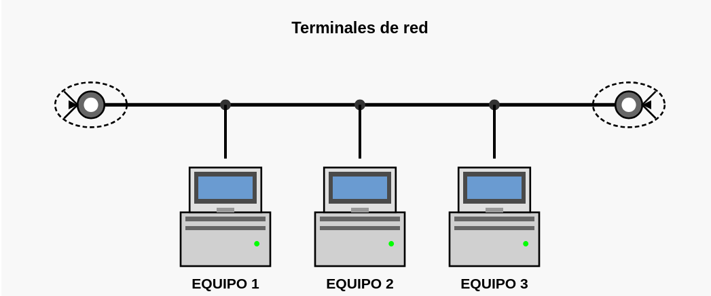
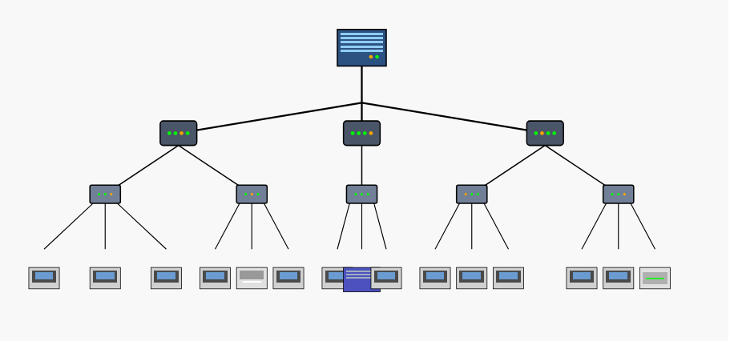

  
# Redes Informáticas

## Redes de datos  

Las redes de datos surgen ante la necesidad de comunicar y compartir información entre usuarios. Una red de datos informática mantiene los beneficios del ordenador personal (software propio, información personal, etc.), pero añadiendo la posibilidad de compartir recursos software y hardware con otros usuarios, lo que aporta unas enormes ventajas:  

**· Recursos compartidos:** los equipos conectados a una red pueden compartir determinados componentes como impresoras, unidades de discos, etcétera.
  
**· Dispositivos de protección de datos:** se puede programar la realización de copias de seguridad, por ejemplo, de todos los discos duros de la red.
  
**· Posibilidad de acceder a un soporte de datos com-partidos:** los usuarios pueden disponer de una base de datos común.
  
**· Procesamiento distribuido:** se puede repartir una tarea entre varios equipos, obteniendo una mayor potencia.
  
**· Alternativas de comunicación:** los usuarios pueden comunicarse con otros a través de aplicaciones informáticas específicas, por ejemplo mediante correo electrónico, videoconferencia, etcétera.
  
**· Capacidad de ampliación:** las redes de datos permiten una rápida expansión y es muy fácil añadir elementos nuevos,

### Elementos

Para que la comunicación sea posible, se necesita un elemento que realice la transmisión (trans-misor) y otro que reciba los datos enviados (receptor) a través de un medio (canal de transmisión).

El **transmisor** es el elemento del sistema encargado de generar y preparar la información de forma adecuada para que viaje por el canal de transmisión.

El **receptor** es el elemento encargado de recuperar la información del canal (demodulación o decodificación) e interpretarla.

El **canal** de transmisión es el medio utilizado para hacer llegar la información. La transmisión se realiza habitualmente empleando ondas electromagnéticas que se propagan a través del canal. El canal de transmisión puede ser guiado o no. Un medio guiado es aquel compuesto por un material físico sólido encargado de llevar la señal de información por su interior, por ejemplo, un cable. Sin embar-go, en un medio no guiado, el canal es el aire y tanto la transmisión como la recepción de información se realizan mediante antenas o mediante emisores y sensores ópticos.  

Un sistema de comunicaciones puede verse afectado por **contaminantes** que modifican la señal transportada sobre el medio de transmisión. Estos contaminantes producen que el mensaje recibido no sea exactamente igual al transmitido. Estos contaminantes son imposibles de eliminar, por tanto, un objetivo de los sistemas de comunicaciones es reducir su incidencia.  

## Topologías y estructura  

Una red de datos está compuesta por equipos que están conectados entre sí mediante líneas de comunicación (cables de red, etc.) y elementos de hardware (adaptadores de red y otros equipos que garantizan que los datos viajen correctamente).
La configuración física, es decir, la configuración espacial de la red, se denomina topología física. El objetivo de cada topología es encontrar la forma más económica y eficaz de comunicar los equipos. Dependiendo de cómo se conecten los quipos entre sí, da lugar a varios tipos de configuraciones:  

**· Topología de bus (Ethernet):** en esta configuración, todos los equipos (ordenadores, impresoras, etc.) tienen una dirección diferente y están unidos en la red local por una única línea denominada bus, que suele ser un cable coaxial. Cuando un equipo envía un mensaje, indica la dirección del equipo al que va dirigido. El mensaje al entrar en la red llega a todos los equipos, de forma que los que no tienen la dirección especificada por el mensaje ignoran su contenido y el que tiene la dirección especificada lee la información contenida. La capacidad de la red va decreciendo a medida que aumenta el número de equipos conectados. El fallo de un equipo no interrumpe el funcionamiento de la red, pero el fallo en el cable hace que la red deje de funcionar.

**· Topología en anillo (Token-Ring):**  en esta topología todos los equipos están conectados a la red en forma de lazo. Cuando un equipo envía un mensaje, indica la dirección del equipo al que va dirigido. El mensaje entra en la red y empieza a recorrer todo el anillo, de forma que los equipos que no tienen la dirección especificada por el mensaje ignoran su contenido y el que tiene la dirección especificada lee la información contenida. La ventaja de esta configuración con la anterior consiste en que si se rompe la red por un punto, los mensajes siguen llegando al resto de los equipos de la red.

**· Topología de estrella (Ethernet):** en esta configuración, todos los equipos están conectados por líneas separadas que van al mismo nodo o estación central. La función de esta estación central consiste en conectar las líneas con cualquiera de las otras. Cuando un equipo envía un mensaje, indica la dirección del equipo al que va dirigido. El mensaje, al llegar a la estación central, es dirigido a la línea que conecta con el equipo que tiene la dirección del mensaje. Para evitar que algunos equipos monopolicen la red, la estación central concede una porción de tiempo a cada una de las líneas de la red cuando hay enviándose varios mensajes.

[Imágenes](Images_Redes/4.png)

**· Topología de árbol:** es una generalización del tipo bus. Tiene su primer equipo en la raíz (cabecera) y se expande hacia fuera utilizando ramas, en donde se conectan los demás equipos. Esta topología permite que la red se expanda y, al mismo tiempo, asegura que nada más existe una ruta de datos entre dos equipos cualesquiera. Esta configuración suele utilizarse en redes grandes.  

[Imágenes](Images_Redes/5.png)

**· Topología de malla:** es una combinación de más de una topología, como podría ser una bus combinada con una estrella. Este tipo de topología es común en lugares en donde tenían una red de bus y luego la fueron expandiendo en estrella. Son complicadas para detectar una avería por parte del servicio técnico. La ventaja de esta red es que permite garantizar la comunicación entre equipos porque dada su complejidad siempre existen varios caminos posibles.

[Imágenes](Images_Redes/6.png)

### Internet

Internet es una red de redes de alcance mundial que permite la interconexión descentralizada de redes de datos utilizando el protocolo TCP/IP.

El desarrollo de internet ha superado ampliamente cualquier previsión y ha constituido una verdadera revolución en la sociedad moderna.

Una buena red de contactos es fundamental en los negocios y, aprovechando la conectividad que brinda internet, nace el servicio Networking. El Networking está basado en una red de contactos profesionales que permite dar a conocer un negocio, escuchar y aprender de los demás, econtrar posibles colaboradores, socios o inversores. 

## Tipos de redes de datos

Las redes de datos pueden clasificarse atendiendo a diversos criterios. La más común es con relación al tamaño de la red (área de distribución), pudiéndose encontrar los siguientes tipos:  

### LAN o Red de área local  

Su extensión está limitada físicamente a un edificio o como mucho a edificios contiguos. Es una red privada para conectar ordenadores personales y estaciones de trabajo en oficinas, fábricas, etcétera.  

### WLAN o Red de área local inalámbrica  

Es una red de área local sin cables, utiliza tecnologías de radiofrecuencia que permiten mayor movilidad al minimizar las conexiones cableadas. Se utiliza como alternativa a la red LAN o como extensión de estas con un alcance aproximado de 100 metros. Existen varios tipos de tecnologías:  

**· Wi-Fi o estándar IEEE 802.11:** es una tecnología de comunicación inalámbrica con el respaldo de WECA
(Wireless Ethernet Compatibility Alliance). Es el estándar más extendido para la creación de redes WLAN.
Actualmente hay seis versiones importantes:
- **802.11a**, hasta 54 Mb/s en la banda de 5 GHz.
- **802.11b**, hasta 11 Mb/s en la banda de 2,4 GHz.
- **802.11g**, hasta 54 Mb/s en la banda de 2,4 GHz.
- **802.11n**, hasta 300 Mb/s en la banda de 2,4 GHz.
- **802.11ac**, hasta 1 Gb/s en la banda de 5 GHz.
- **802.11ad**, hasta 7,2 Gb/s en las bandas de 2,4 GHz, 5 GHz y 60 GHz.

**· HiperLAN (High Performance Radio LAN):** es un estándar europeo desarrollado por ETSI (European Telecommunications Standards Institute). Su última versión, la HiperLAN2, permite a los usuarios alcanzar una velocidad máxima de 54 Mb/s en un área aproximada de 100 metros.

### MAN o Red de área metropolitana  

Esta red es una versión más grande de una LAN que cubre ciudades enteras y, normalmente, se basa en una tecnología similar. La principal razón para distinguir las MAN como una categoría especial es que se ha adoptado un estándar para ellas, DQDB (Distributed-Queue Dual-Bus) o bus dual de cola distribuida, para asegurar una alta velocidad.  

### WAN o Red de área extensa  

Engloba todas las redes de datos que cubren un área geográfica extensa. Normalmente, una WAN está compuesta por un grupo de LAN conectadas a través de enlaces, ya sean cableados o inalámbricos. Un ejemplo de este tipo de redes sería RedIRIS, internet o cualquier red en la cual no estén en un mismo edificio todos sus miembros.  

## Modelos en capa  

La comunicación entre dos equipos conectados a una red de datos es un proceso complejo. Por tanto, el estudio y el desarrollo de estas redes es una tarea complicada. Para facilitarla, se emplean estrategias modulares, que dividen el problema complejo en partes más simples. Cada parte se encarga de realizar, de manera transparente para las demás, una determinada función dentro del proceso de comunica-ción. De este modo, cada parte del proceso se despreocupa del resto y únicamente se encarga de las tareas de su nivel o capa. Así, esta idea de dividir en partes el proceso de comunicación desemboca en un modelo en capas.  

El modelo en capas es jerárquico, esto es, las capas se sitúan una encima de otra, por lo que es posible distinguir entre capa superior y capa inferior. Una capa únicamente atenderá a las peticiones de la capa inmediatamente superior y solo pedirá tareas a la capa inmediatamente inferior. Cada capa se encargará de llevar a cabo la tarea solicitada de manera transparente para el resto de las capas.

[Imágenes](Images_Redes/6.png)

### Modelo OSI

