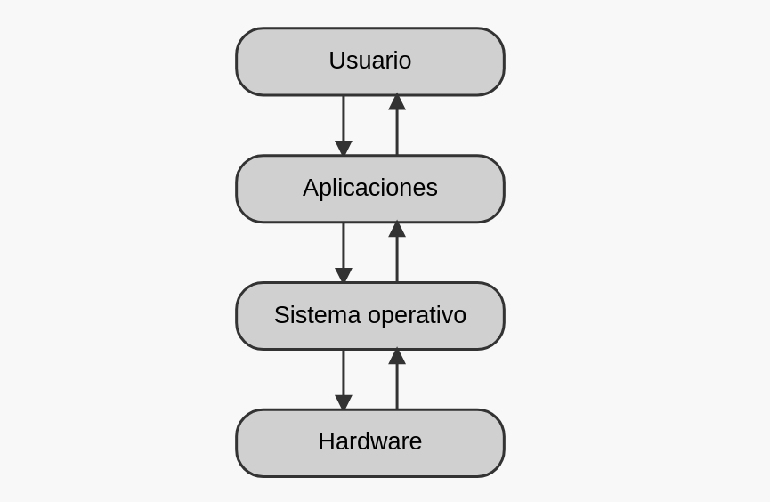

  
# Sistemas Operativos

  
Un sistema operativo es un conjunto de programas básicos que permiten manejar, organizar y optimizar los ficheros de datos y programas de las unidades de disco del sistema informático. Los ordenadores no pueden funcionar sin un sistema operativo, aunque cuenten con los mejores programas del mercado, o el mejor hardware del momento. De hecho, se podría encender, pero no valdría de mucho, no podría pedir que se introdujera comando alguno y mucho menos darle una orden.

En realidad, lo primero que realiza el sistema informático al arrancar (entre otras cosas) es cargar de una unidad de disco los ficheros del sistema y ejecutarlos. Tras unos instantes, el ordenador está preparado para empezar a ejecutar el programa o las órdenes que se le indique.

Existen una gran variedad de sistemas operativos, con diferentes características, que ofrecen una serie de ventajas e inconvenientes dependiendo del ordenador o el entorno donde se utilicen: UNIX, Linux, Windows, VMS, Solaris, etc. Sin embargo, actualmente el sistema operativo más extendido es Windows.  

La misión principal del sistema operativo es hacer de intérprete entre el usuario que está delante del teclado y el hardware del ordenador. Además de interpretar los comandos que permiten al usuario comunicarse con el ordenador, el sistema operativo realiza las siguientes funciones:  

**· Gestión de recursos:** coordina y manipula el hardware del sistema informático, como la memoria, las impresoras, las unidades de disco, el teclado o el ratón. En un ordenador actual suelen coexistir varios programas, del mismo o de varios usuarios, ejecutándose simultáneamente. Estos programas compiten por los recursos del ordenador, siendo el sistema operativo el encargado de arbitrar su asignación y uso.
  
**· Gestión y mantenimiento de archivos:** organiza los archivos en diversos dispositivos de almacenamien-to, como discos duros, discos ópticos, etc. El sistema operativo guarda los archivos en los dispositivos de almacenamiento, dentro de directorios y subdirecto-rios, de manera organizada y asegurando que el espacio se usa de la forma más eficiente.
  
**· Manejo de errores:** gestiona los errores de hardware y la pérdida de datos.
  
**· Secuencia de tareas:** el sistema operativo debe administrar el orden de las tareas (quién va primero y quién después).
  
**· Protección:** como complemento a la gestión de recur-sos, el sistema operativo debe evitar que las acciones de un usuario afecten al trabajo que está realizando
otro usuario.

